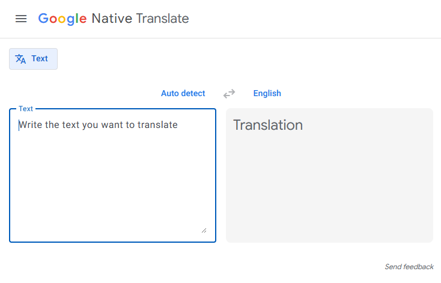
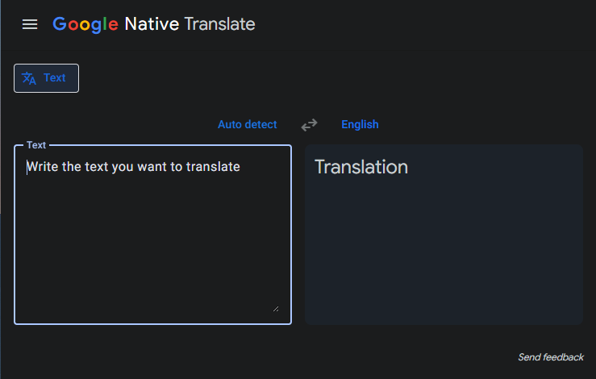

# 🌐 Google Native Translate

[](https://opensource.org/licenses/MIT)
[](https://nodejs.org/)
[](https://pnpm.io/)
[](https://angular.io/)
[](https://github.com/DevJaGz/google-native-translate)
[](https://github.com/DevJaGz/google-native-translate)

> Translate text using local AI models in your browser. Fast, private, and works offline.

**Google Native Translate** is an independent educational project that leverages the browser's native AI capabilities to provide translation services without sending data to external servers. Built with modern web technologies and clean architecture principles.

## ✨ Features

- 🔒 **Privacy-First** - All translations happen locally in your browser. No data is sent to external servers
- 📴 **Offline Support** - Works without an internet connection once models are downloaded
- 🏗️ **Clean Architecture** - Built following Clean and Hexagonal Architecture principles for maintainability and scalability
- 🎨 **Modern UI** - Beautiful interface with light and dark mode support
- 🧩 **Best Practices** - Follows industry-standard coding practices and patterns

## 📸 Screenshots

<div align="center">
  
  
</div>

## 🚀 Demo

Check out the live demo: [https://google-native-translate.vercel.app/](https://google-native-translate.vercel.app/)

## 🛠️ Technology Stack

- **Framework**: [Angular 20](https://angular.io/)
- **UI Components**: [Angular Material](https://material.angular.io/)
- **Styling**: [TailwindCSS v4](https://tailwindcss.com/)
- **Architecture**: Clean Architecture & Hexagonal Architecture
- **Browser APIs**: 
  - [Language Detector API](https://developer.mozilla.org/en-US/docs/Web/API/LanguageDetector)
  - [Translator API](https://developer.mozilla.org/en-US/docs/Web/API/Translator)

## 📋 Prerequisites

- **Node.js**: v22.12.0
- **pnpm**: v10.11.1

## 🔧 Installation

```bash
# Clone the repository
git clone https://github.com/DevJaGz/google-native-translate.git

# Navigate to project directory
cd google-native-translate

# Install dependencies
pnpm install
```

## 🏃 Running the Application

```bash
# Start development server
pnpm start
```

The application will be available at `http://localhost:4200`

## 🌍 Browser Compatibility

This application uses experimental browser APIs. Browser support varies:

- **[Translator API Browser Support](https://developer.mozilla.org/en-US/docs/Web/API/Translator#browser_compatibility)** - Check which browsers support the Translator API
- **[Language Detector API Browser Support](https://developer.mozilla.org/en-US/docs/Web/API/LanguageDetector#browser_compatibility)** - Check which browsers support the Language Detector API

> **Note**: These are experimental features and may require specific browser flags to be enabled.

## 🏛️ Architecture

This project implements **Clean Architecture** and **Hexagonal Architecture** patterns to ensure:

- 🔄 Separation of concerns
- 🧪 Testability
- 🔌 Independence from frameworks and external dependencies
- 📦 Modularity and maintainability

For detailed architecture documentation, visit: [Architecture Documentation](https://deepwiki.com/DevJaGz/google-native-translate)

## 🗺️ Roadmap

- [ ] 🎤 Speech-to-Text functionality
- [ ] 🔊 Audio output for translations
- [ ] 📝 Additional language pairs
- [ ] 💾 Translation history
- [ ] 🔖 Favorite translations

## 🤝 Contributing

Contributions are welcome! Please feel free to submit a Pull Request. For major changes, please open an issue first to discuss what you would like to change.

1. Fork the repository
2. Create your feature branch (`git checkout -b feature/AmazingFeature`)
3. Commit your changes (`git commit -m 'Add some AmazingFeature'`)
4. Push to the branch (`git push origin feature/AmazingFeature`)
5. Open a Pull Request

## 📄 License

This project is licensed under the MIT License - see the [LICENSE](LICENSE) file for details.

## 👨‍💻 Author

**Julian Andres Gomez Gomez**

- Website: [https://www.juliangomez.dev/](https://www.juliangomez.dev/)
- GitHub: [@DevJaGz](https://github.com/DevJaGz)

## ⚠️ Disclaimer

This is an independent educational project and is **not associated with, endorsed by, or sponsored by Google LLC or Google Translate**. All trademarks are the property of their respective owners.

## 🙏 Acknowledgments

- Thanks to the browser vendors for implementing native translation APIs
- Angular team for the amazing framework
- The open-source community for inspiration and tools

---

<div align="center">
  Made with ❤️ by <a href="https://www.juliangomez.dev/">Julian Gomez</a>
</div>

<div align="center">
  ⭐ Star this repository if you find it helpful!
</div>